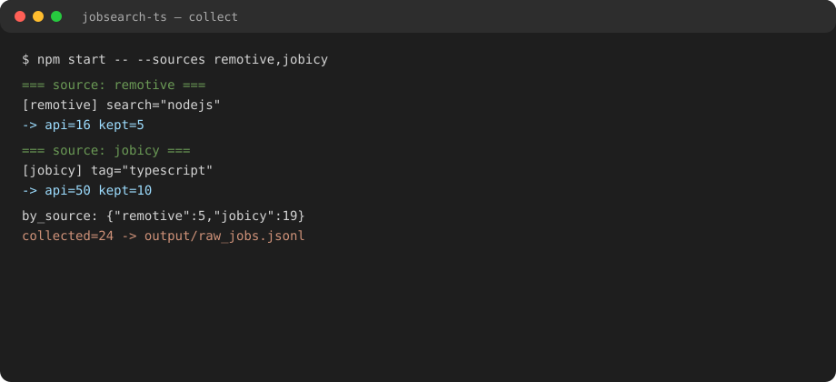
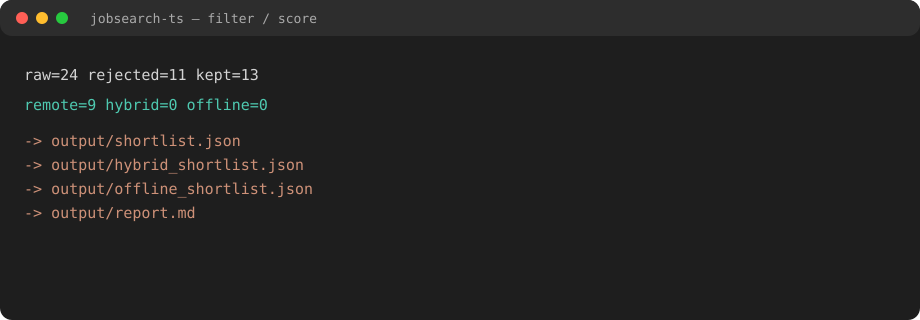
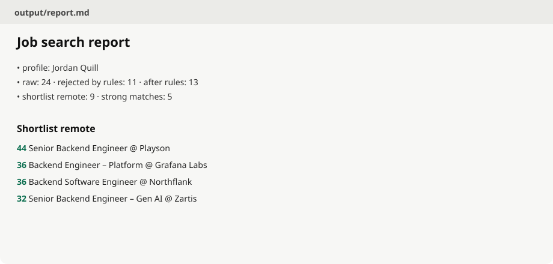
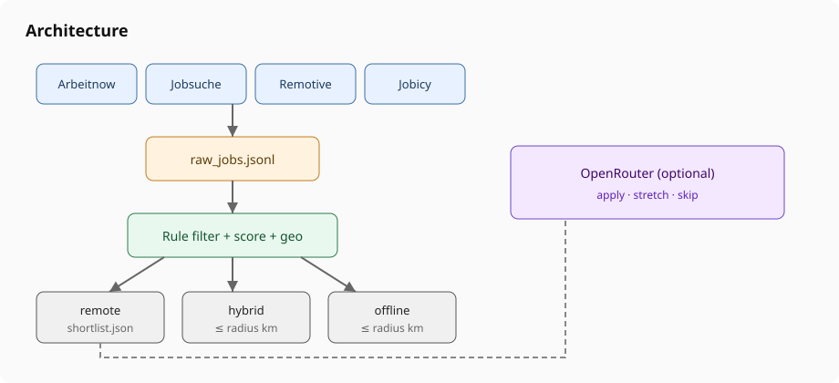
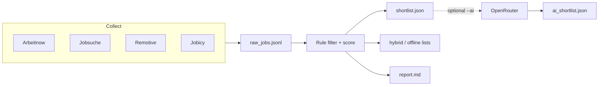

# JobSearch TS

**Turn noisy job boards into a ranked shortlist for remote Node/TypeScript backend roles in Germany / EU** — rules first, optional LLM second.

A small TypeScript CLI that collects from public APIs, filters with deterministic heuristics, scores fit, and (optionally) reviews survivors via OpenRouter. Portfolio-oriented: ESM, strict TS, config-driven, no framework stack.

[](https://github.com/IliaMrt/jobsearch/actions/workflows/ci.yml)

## Why it exists

Job search for a **junior–mid Node/TS backend** profile is noisy: wrong stack, office-only, senior-only, EN-first, freelance. Manual scanning does not scale. This pipeline:

1. Pulls candidates from several APIs into one schema
2. Drops clear mismatches with transparent reasons
3. Scores the rest so you open the best links first
4. Optionally asks a cheap model for `apply` / `stretch` / `skip`

You keep control: thresholds live in `config.yaml`, not buried in prompts.

## Demo

Sample run (Remotive + Jobicy only) and committed artifacts:

| Artifact | What you see |
|----------|----------------|
| [docs/demo/terminal.txt](docs/demo/terminal.txt) | CLI collect + filter summary |
| [docs/demo/report.md](docs/demo/report.md) | Human-readable shortlist report |
| [docs/demo/shortlist.json](docs/demo/shortlist.json) | Ranked remote shortlist (trimmed) |

Screenshots:

| | |
|--|--|
|  |  |
|  |  |

Reproduce locally (no API key needed for collect/filter):

```bash
npm install
npm start -- --sources remotive,jobicy
# open output/report.md
```

Optional AI pass:

```bash
cp .env.example .env   # set OPENROUTER_API_KEY
npm start -- --skip-collect --ai
```

## Architecture



```
APIs ──► normalize ──► raw JSONL
                          │
                          ▼
              rules + geo + scoring
                          │
          ┌───────────────┼───────────────┐
          ▼               ▼               ▼
       remote         hybrid ≤R      offline ≤r
       shortlist       shortlist      shortlist
          │
          └─ optional LLM review ──► apply / stretch
```

## Requirements

- Node.js **20+**
- Network access to the job APIs
- Optional: `OPENROUTER_API_KEY` for `--ai` / `--ai-only`

## Setup

```bash
git clone https://github.com/IliaMrt/jobsearch.git
cd jobsearch
npm install
cp .env.example .env
# Public config/profile are fictional. For a real search, copy to
# config.local.yaml / profile.local.md (gitignored) and point --config at them.
```

### Environment variables

Copy [`.env.example`](.env.example). Never commit a real `.env`.

| Variable | Required | Description |
|----------|----------|-------------|
| `OPENROUTER_API_KEY` | Only for AI review | Key from [openrouter.ai/keys](https://openrouter.ai/keys) |

## Usage

```bash
npm start
npm start -- --skip-collect
npm start -- --merge --sources arbeitnow,jobsuche,remotive,jobicy
npm start -- --ai
npm start -- --ai-only
```

| Flag | Meaning |
|------|---------|
| `--config <path>` | Config file (default `config.yaml`) |
| `--skip-collect` | Reuse `output/raw_jobs.jsonl` |
| `--merge` | Union new results with existing raw file (by id; longer description wins) |
| `--sources a,b,…` | Collect only listed sources |
| `--ai` | Run OpenRouter review after filter |
| `--ai-only` | AI review only on `filtered_jobs.jsonl` |

Exit code `2` means collect was incomplete / rate-limited (see `output/collect_stats.json`).

## Output

| File | Content |
|------|---------|
| `output/raw_jobs.jsonl` | Normalized jobs from all sources |
| `output/filtered_jobs.jsonl` | Passed rules, with scores and reasons |
| `output/shortlist.json` | Remote shortlist (or AI-kept jobs if `--ai`) |
| `output/hybrid_shortlist.json` | Hybrid within `geo.hybrid_radius_km` |
| `output/offline_shortlist.json` | Office / non-remote within `geo.offline_radius_km` |
| `output/report.md` | Human-readable summary |
| `output/ai_shortlist.json` | AI apply / stretch lists |

## Project layout

```
src/
  index.ts          CLI entry
  collect.ts        Orchestrates sources
  filter.ts         Rules + scoring
  ai-review.ts      OpenRouter review
  geo.ts            Home-radius helpers
  rate-limit.ts     Backoff + collect stats
  sources/          One module per API
config.yaml         Search profile + thresholds (example data)
profile.md          Short candidate brief for the LLM
docs/demo/          Sample artifacts from a real run
docs/screenshots/   README visuals
```

## Tests & CI

```bash
npm run typecheck
npm test
```

GitHub Actions runs typecheck + tests on push and pull requests (see [`.github/workflows/ci.yml`](.github/workflows/ci.yml)).

## Design notes

- **Config over code** for keywords, weights, and radii — tune without touching TypeScript.
- **Rules first, LLM second** — cheap deterministic pass; AI only on survivors.
- **Public APIs only** — no LinkedIn scraping, so the example stays runnable and ToS-friendly.
- **Anonymized defaults** — `config.yaml` / `profile.md` use a clearly fictional candidate. Keep a real search profile in gitignored `config.local.yaml` / `profile.local.md` (or a private fork).

## License

MIT
